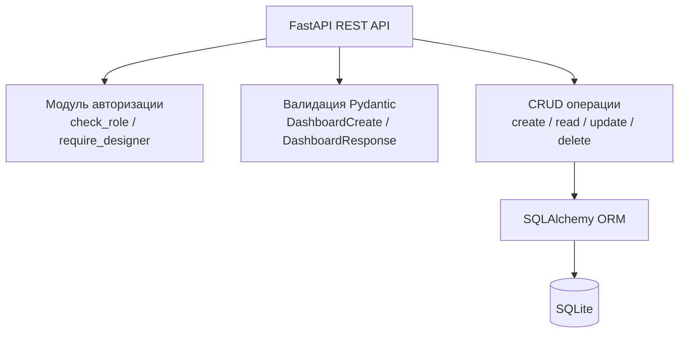
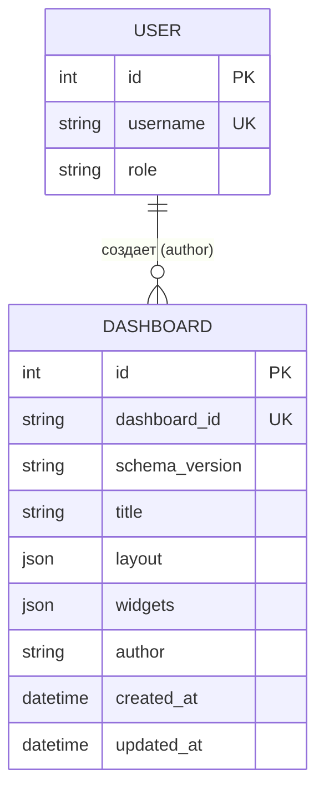

Документация API: [koteikipivo.ru/techno/docs](https://koteikipivo.ru/techno/docs)<br/>
Также, для тестирования без установки последняя версия API развернута по ссылке https://koteikipivo.ru/techno

# Постановка задачи
Разработать backend-сервис — ядро модульной BI-платформы, которое обеспечивает хранение, валидацию и управление описаниями дашбордов в формате JSON. Сервис должен предоставлять REST API для выполнения CRUD-операций, проверять корректность входных данных по утверждённой схеме и отдавать списки доступных источников данных и виджетов.

# Анализ предметной области
Перед началом работы были выбраны модули Pydantic и FastAPI для основного задания, а также решено использовать SQLite для хранения данных и SQLAlchemy для простого обращения к базе данных. Данные решения были приняты за счет интереса изучения и популярности среди похожих проектов.

# Обзор аналогов
Для всех рассмотренных аналогов был использован архитектурный стиль REST API. В Metabase для хранения данных используется PostgreSQL и данные валидируются на уровне базы данных. В Apache Superset, как и в нашем проекте, используется SQLAlchemy, а данные валидируются на уровне приложения при помощи Pydantic. В Grafana дашборды хранятся в виде JSON-документов в базе данных, а их валидация происходит на этапе сохранения через проверку соответствия внутренней JSON-схеме.

# Функциональные требования
- Создание дашборда — принять JSON-описание, проверить его на корректность, сохранить.
- Получение дашборда — отдать сохранённое описание по его ID.
- Список дашбордов — отдать список всех сохранённых дашбордов.
- Обновление и удаление дашборда.
- Валидация: если пришёл “кривой” JSON (например, без обязательного поля), сервис должен вернуть понятную ошибку, а не просто упасть.
- Список источников данных и виджетов — на первых порах можно вернуть просто список названий (в будущем сюда подключатся реальные модули других студентов).

# Архитектурное решение


Ядро разрабатывалось по трёхуровневой архитектуре, делящее его на уровень представления (REST API), уровень логики (CRUD операции и аутентификация) и уровень данных (SQLite база данных и обращение к ней через SQLAlchemy).
Модуль аутентификации является работой номер 6. В ходе разработки оказалось удобно встроить его в существующий код ядра платформы, поэтому он не является внешним модулем.

# Проектирование данных
Данные модуля хранятся в SQLite базе данных с данной схемой:

Формат данных в JSON:
```json
{
  "schema_version": "1.0",
  "dashboard_id": "sales-overview",
  "title": "Обзор продаж",
  "layout": {
    "type": "grid",
    "columns": 12
  },
  "widgets": [
    {
      "widget_id": "w1",
      "type": "line_chart",
      "position": { "x": 0, "y": 0, "w": 6, "h": 4 },
      "config": {
        "x_field": "date",
        "y_field": "revenue",
        "title": "Выручка по дням"
      }
    }
  ],
  "datasets": [
    {
      "dataset_id": "sales_2026",
      "columns": [
        { "name": "date", "type": "date" },
        { "name": "revenue", "type": "number" }
      ],
      "rows": [
        ["2026-01-01", 120000],
        ["2026-01-02", 98000]
      ]
    }
  ]
}
```
Формат тестового датасета (для виджетов):
```json
{
  "dataset_id": "sales_2026",
  "columns": [
    { "name": "date", "type": "date" },
    { "name": "revenue", "type": "number" }
  ],
  "rows": [
    ["2026-01-01", 120000],
    ["2026-01-02", 98000]
  ]
}
```

# Описание интерфейсов


# Описание API
URL для API: `http://127.0.0.1:8011/api/v1`

## Таблица эндпоинтов
| Метод | URL | Назначение | Доступно роли Viewer |
|-------|-----|------------|-----------------|
| POST | `/dashboards` | Создать дашборд | ❌ Нет |
| GET | `/dashboards` | Получить все дашборды | ✅ Да |
| GET | `/dashboards/{dashboard_id}` | Получить дашборд по ID | ✅ Да |
| PUT | `/dashboards/{dashboard_id}` | Обновить дашборд | ❌ Нет |
| DELETE | `/dashboards/{dashboard_id}` | Удалить дашборд | ❌ Нет |
| GET | `/sources` | Список источников данных | ✅ Да |
| GET | `/widgets` | Список виджетов | ✅ Да |

## Примеры запросов
### Создать дашборд
```bash
curl -X POST http://127.0.0.1:8011/api/v1/dashboards \
  -H "Content-Type: application/json" \
  -H "User-id: test-designer" \
  -H "Role: Designer" \
  -d '{
    "dashboard_id": "sales-overview",
    "title": "Обзор продаж",
    "layout": {"type": "grid", "columns": 12},
    "widgets": [
      {
        "widget_id": "w1",
        "type": "line_chart",
        "position": {"x": 0, "y": 0, "w": 6, "h": 4},
        "config": {"x_field": "date", "y_field": "revenue", "title": "Выручка по дням"}
      }
    ],
    "datasets": [
      {
        "dataset_id": "sales_2026",
        "columns": [{"name": "date", "type": "date"}, {"name": "revenue", "type": "number"}],
        "rows": [["2026-01-01", 120000], ["2026-01-02", 98000]]
      }
    ]
  }'
  ```
### Получить дашборд по ID
```bash
curl http://127.0.0.1:8011/api/v1/dashboards/sales-overview
```
### Удалить дашборд
```bash
curl -X DELETE http://127.0.0.1:8011/api/v1/dashboards/sales-overview
```

# Структура проекта
```bash
app/
├── __init__.py                  # Маркер пакета
├── main.py                      # Точка входа, создание таблиц
├── database.py                  # Подключение к SQLite, модели
├── schemas.py                   # Pydantic-схемы (валидация)
├── crud.py                      # CRUD-операции с БД
├── routes.py                    # Эндпоинты API
└── auth.py                      # Ролевая модель (Designer/Viewer)

tests/
├── __init__.py
└── test_api.py                  # Автотесты с pytest

project root/
├── Makefile                     # Команды: init, run, test, clean
├── requirements.txt             # Зависимости проекта
├── README.md                    # Документация
└── dashboards.db                # Файл SQLite БД (создаётся при запуске, удаляется с make clean)
```

# Инструкция по запуску
### Клонирование репозитория
```bash
git clone https://github.com/KoteikiPivo/techno_core_platform.git
cd techno_core_platform
```
### Установка зависимостей
```bash
make init
```
### Запуск
```bash
make run
```
### Тестирование
```bash
make test
```
### Очистка
```bash
make clean
```
<br/>
API будет доступен по ссылке [127.0.0.1:8011](http://127.0.0.1:8011/), а документация по [127.0.0.1:8011/docs](http://127.0.0.1:8011/docs)

# Результаты тестирования

# Выводы

# Перспективы развития
