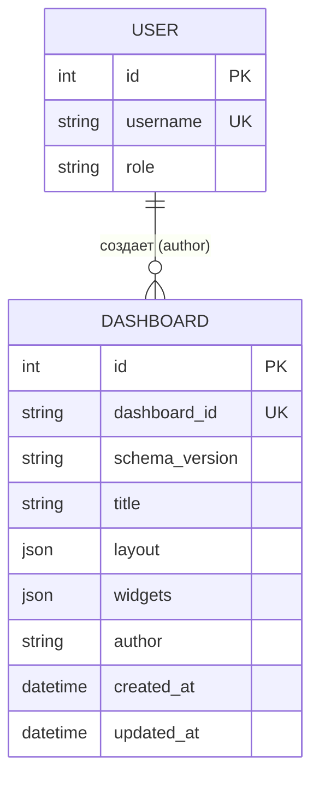

```mermaid
erDiagram
    DASHBOARD {
        int id PK
        string dashboard_id UK
        string schema_version
        string title
        json layout
        json widgets
        string author
        datetime created_at
        datetime updated_at
    }
    USER {
        int id PK
        string username UK
        string role
    }
    USER ||--o{ DASHBOARD : "создает (author)"
```
